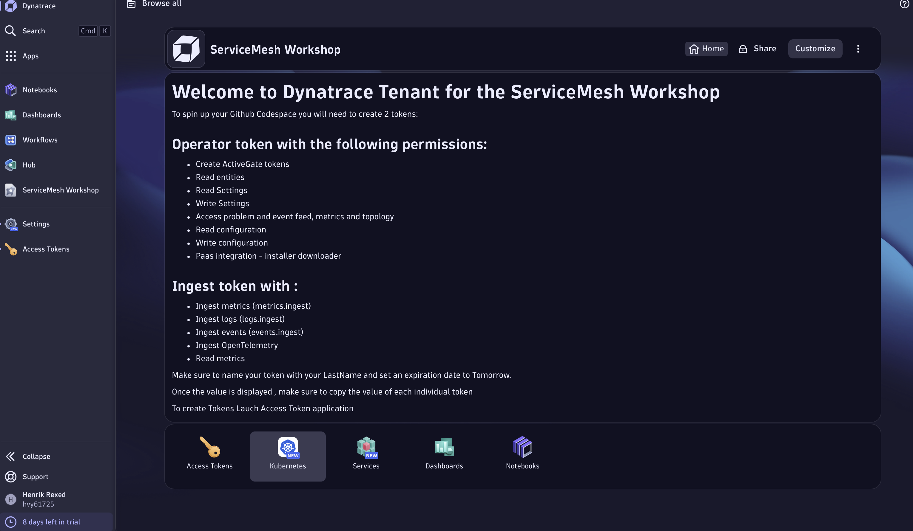

--8<-- "snippets/tenant-id.md"

## Gather Details: Create API Token

This Workshop requires 2 API tokens:
* One to deploy the Dynatrace Operator
* One to ingest metrics, logs, traces and events

You have been invited to a Dynatrace tenant.

All the relevant applications are displayed on your welcome screen:


--8<-- "snippets/api-token.md"


--8<-- "snippets/info-required.md"

--8<-- "snippets/servicemesh-type.md"

## Start Demo

=== "Run in Cloud"
--8<-- "snippets/codespace-details-warning-box.md"

    Click this button to launch the demo in a new tab.

    [](https://codespaces.new/isItObservable/servicemeshsecuritybenchmark.git){target=_blank}

=== "Run Locally"
* Clone the repository to your local machine

    ```
    git clone -b V3-Workshop --single-branch https://github.com/isItObservable/servicemeshsecuritybenchmark.git
    ```

    * Open the folder in Visual Studio code
    * Ensure the [Microsoft Dev Containers extension](https://marketplace.visualstudio.com/items?itemName=ms-vscode-remote.remote-containers){target=_blank} and [Dev Containers CLI](https://code.visualstudio.com/docs/devcontainers/devcontainer-cli#_installation){target=_blank} are installed in VSCode
    * Open a new terminal in VSCode and set your environment variables as appropriate:

    ```
    set DT_ENVIRONMENT_ID=abc12345
    set DT_ENVIRONMENT_TYPE=live
    set DT_API_TOKEN=dt0c01.******.***********
    set DT_OPERATOR_TOKEN=dt0c01.******.***********
    set SM_TYPE=istio ( value could be equal to : kuma, linkerd, istio, ambient, ambient-kgateway
    set NAME= <Name of your environment
    ```

    * Start Docker / Podman
    * Create the environment

    ```
    devcontainer up
    ```

    It will take a few moments but you should see:

    ```
    {"outcome":"success","containerId":"...","remoteUser":"root","remoteWorkspaceFolder":"/workspaces/servicemeshsecuritybenchmark"}
    ```

    * Connect to the demo environment. This will launch a new Visual Studio Code window
    ```
    devcontainer open
    ```

    In the new Visual Studio code window, open a new terminal and continue with the tutorial.

<div class="grid cards" markdown>
- [Click Here to Run the Demo :octicons-arrow-right-24:](workshop.md)
</div>