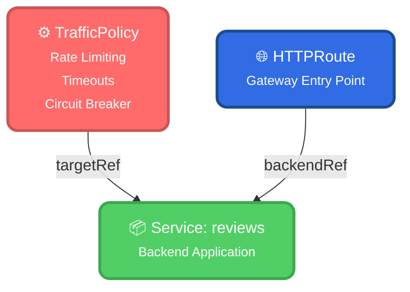
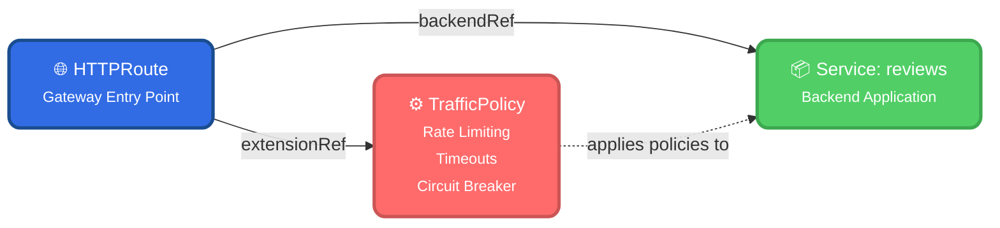
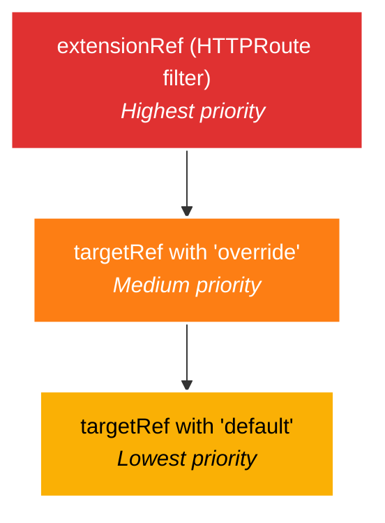
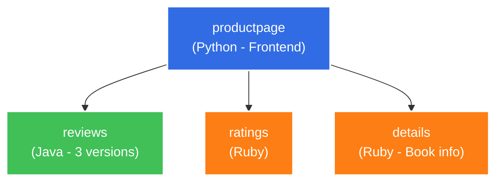
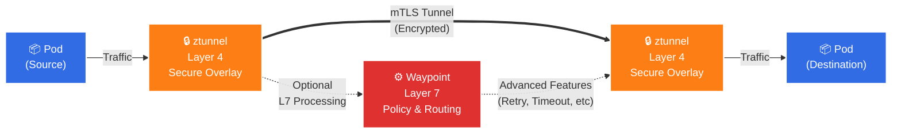
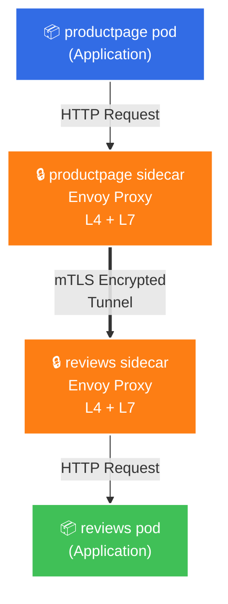
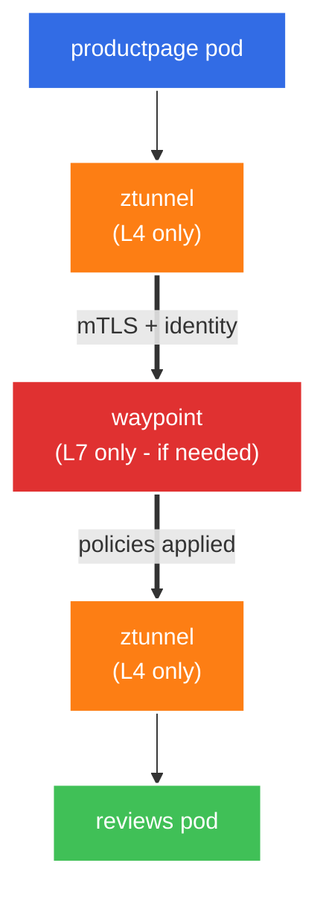
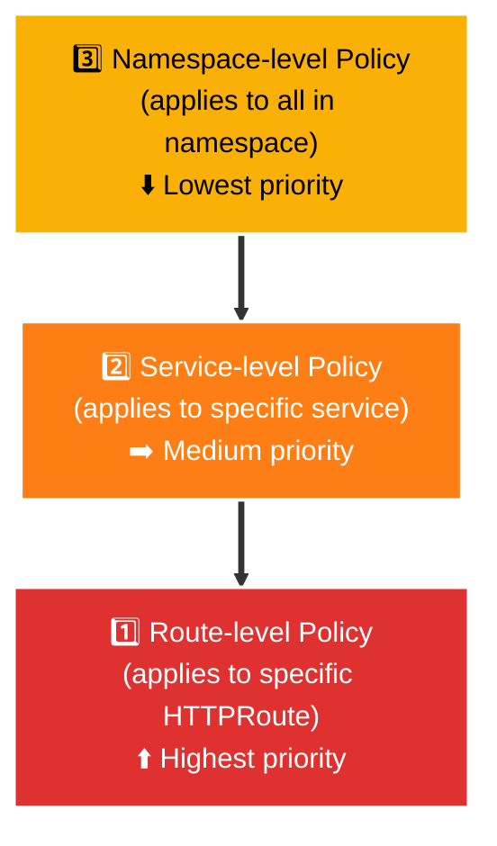
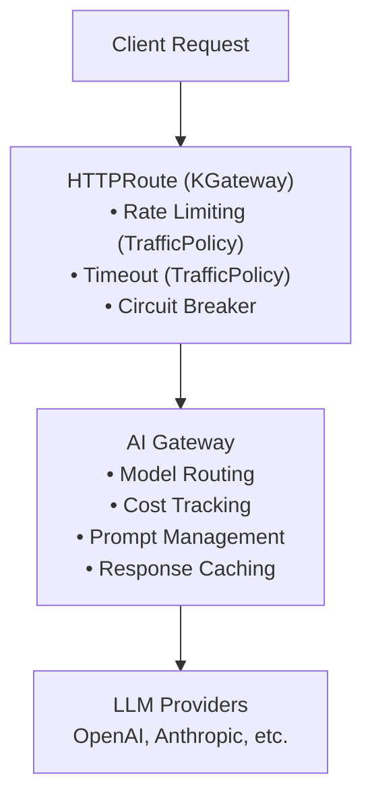

# Service Mesh Workshop: Gateway API, Ambient Architecture & AI-Enhanced Gateways


**Level:** Intermediate  

## Workshop Overview

Learn how to leverage Gateway API for service-to-service communication and implement resilience patterns using:
1. Gateway API HTTPRoutes (GAMMA pattern)
2. Rate limiting, circuit breakers, and timeouts
3. Ambient mesh architecture and benefits
4. KGateway for advanced features and AI capabilities


### Verify Your Environment

```bash
# Check pods are running
kubectl get pods -n booking

# Expected: productpage, reviews-v1/v2/v3, details-v1, ratings-v1
# All should show 2/2 or 1/1 depending on mesh type
```

### The GAMMA Pattern: Service-to-Service Routing

**Traditional Gateway API (Ingress):**
```yaml
# External traffic: Internet → Gateway → Service
parentRefs:
  - name: bookinfo-gateway
    kind: Gateway
```

**GAMMA (Service Mesh):**
```yaml
# Internal traffic: Service → Service
parentRefs:
  - name: productpage
    kind: Service  # Source service!
```

### Exercise 1: Create Your First Service-to-Service Route

**Task:** Route traffic from productpage to reviews

```bash
kubectl apply -f - <<EOF
apiVersion: gateway.networking.k8s.io/v1
kind: HTTPRoute
metadata:
  name: productpage-to-reviews
  namespace: booking
spec:
  # ParentRef is the SOURCE (where traffic comes FROM)
  parentRefs:
    - group: ""
      kind: Service
      name: productpage
      port: 9080
  # Hostnames: where traffic goes TO
  hostnames:
    - reviews.default.svc.cluster.local
    - reviews
  rules:
    - matches:
        - path:
            type: PathPrefix
            value: /
      backendRefs:
        - name: reviews
          port: 9080
EOF
```

**Verify:**
```bash
kubectl get httproute productpage-to-reviews -n booking
kubectl describe httproute productpage-to-reviews -n booking
```


### Exercise 2: Add productpage → details Route

**Your turn!** Create an HTTPRoute for productpage → details

```bash
# Create the HTTPRoute (fill in the blanks)
kubectl apply -f - <<EOF
apiVersion: gateway.networking.k8s.io/v1
kind: HTTPRoute
metadata:
  name: productpage-to-details
  namespace: booking
spec:
  parentRefs:
    - group: ""
      kind: Service
      name: ???  # What goes here?
      port: 9080
  hostnames:
    - ???  # What goes here?
  rules:
    - backendRefs:
        - name: ???  # What goes here?
          port: 9080
EOF
```

<details>
<summary>Solution</summary>

```yaml
spec:
  parentRefs:
    - group: ""
      kind: Service
      name: productpage
      port: 9080
  hostnames:
    - details.booking.svc.cluster.local
    - details
  rules:
    - backendRefs:
        - name: details
          port: 9080
```
</details>


## Part 1: Resilience Patterns with HTTPRoutes 

### Pattern 1: Request Timeouts

**Why?** Prevent cascading failures by failing fast.

```bash
kubectl apply -f - <<EOF
apiVersion: gateway.networking.k8s.io/v1
kind: HTTPRoute
metadata:
  name: productpage-to-reviews
  namespace: booking
spec:
  parentRefs:
    - group: ""
      kind: Service
      name: productpage
      port: 9080
  hostnames:
    - reviews.booking.svc.cluster.local
  rules:
    - matches:
        - path:
            type: PathPrefix
            value: /
      # Native timeout in Gateway API
      timeouts:
        request: 2s           # Total request timeout
        backendRequest: 1500ms # Backend-specific timeout
      backendRefs:
        - name: reviews
          port: 9080
EOF
```


## Part 2: Understanding GAMMA Policy Attachment 

### What is GAMMA?

**GAMMA** = **Gateway API for Mesh Management and Administration**

It's an initiative to extend Kubernetes Gateway API to handle service mesh use cases, not just ingress.

**Key Goal:** 

Use the same API (HTTPRoute) for:

- ✅ **North-South traffic** (ingress: internet → service)
- ✅ **East-West traffic** (service mesh: service → service)

### The Policy Attachment Problem

**Before GAMMA:** Each mesh had its own way to attach policies:

```yaml
# Istio way
apiVersion: networking.istio.io/v1beta1
kind: DestinationRule
spec:
  host: reviews.default.svc.cluster.local
  trafficPolicy: {...}

# Linkerd way
apiVersion: linkerd.io/v1alpha2
kind: ServiceProfile
spec:
  routes: [...]

# Kuma way
apiVersion: kuma.io/v1alpha1
kind: MeshCircuitBreaker
spec: {...}
```

**Problem:** No standard way to attach policies across different meshes!

### GAMMA Solution: extensionRef

GAMMA introduced **two patterns** for policy attachment:

#### Pattern 1: Direct Policy Attachment (Preferred)

**Concept:** 

Policy CRD  to attach to a resource

=== "kgateway"

    ```yaml
    # Policy targets a specific resource
    apiVersion: gateway.kgateway.dev/v1alpha1
    kind: TrafficPolicy
    metadata:
      name: reviews-policy
    spec:
      # targetRef: "I apply to this resource"
      targetRef:
        group: ""
        kind: Service
        name: reviews
      # Policy configuration
      override:
        timeout: 2s
        retry: {...}
    ```

=== "istio"

    ```yaml
    apiVersion: networking.istio.io/v1
    kind: DestinationRule
    metadata:
    name: bookinfo-ratings
    spec:
        host: reviews.booking.svc.cluster.local
        trafficPolicy:
            loadBalancer:
            simple: LEAST_REQUEST
        subsets:
        - name: testversion
          labels:
            version: v3
          trafficPolicy:
            loadBalancer:
                 simple: ROUND_ROBIN
    ```


=== "ambient"

    ```yaml
    apiVersion: networking.istio.io/v1
    kind: DestinationRule
    metadata:
    name: bookinfo-ratings
    spec:
        host: reviews.booking.svc.cluster.local
        trafficPolicy:
            loadBalancer:
            simple: LEAST_REQUEST
        subsets:
        - name: testversion
          labels:
            version: v3
          trafficPolicy:
            loadBalancer:
                 simple: ROUND_ROBIN
    ```


=== "kuma"

    ```yaml
    apiVersion: kuma.io/v1alpha1
    kind: MeshTimeout
    metadata:
      name: reviews-timeout
      namespace: kuma-system
      labels:
        kuma.io/mesh: default
    spec:
      # Target the route from productpage to reviews
      targetRef:
        kind: MeshService
        name: reviews_booking_svc_9080
      from:
        - targetRef:
            kind: MeshService
            name: productpage_booking_svc_9080
          default:
            # HTTP request timeout
            http:
              requestTimeout: 2s
              # Idle timeout
              idleTimeout: 15s
              # Stream idle timeout
              streamIdleTimeout: 30s
    ```


=== "linkerd"

    ```yaml
    apiVersion: policy.linkerd.io/v1alpha1
    kind: HTTPLocalRateLimitPolicy
    metadata:
      name: details-ratelimit
      namespace: booking
    spec:
      # Target the details server
      targetRef:
        group: policy.linkerd.io
        kind: Server
        name: details-server
      # Rate limit: 50 requests per minute (~0.83 req/s)
      total:
        requestsPerSecond: 1
      identity:
        kind: ServiceAccount
        name: bookinfo-productpage
      overrides:
        - requestsPerSecond: 1
          clientRefs:
            - group: core
              kind: ServiceAccount
              name: bookinfo-productpage
              namespace: booking
    ```

**How it works:**


The policy is **attached directly to the service**, not through the HTTPRoute.

#### Pattern 2: extensionRef in HTTPRoute (Early Concept)

**Concept:** HTTPRoute references external policies via `extensionRef`.

```yaml
apiVersion: gateway.networking.k8s.io/v1
kind: HTTPRoute
metadata:
  name: reviews-route
spec:
  rules:
    - filters:
        # extensionRef: "Apply this policy to my traffic"
        - type: ExtensionRef
          extensionRef:
            group: gateway.kgateway.dev
            kind: TrafficPolicy
            name: reviews-policy
      backendRefs:
        - name: reviews
```

**How it works:**
## **With Kubernetes Colors:**


The policy is **referenced from the HTTPRoute**.

### The Two Patterns: Direct vs Reference

**Direct Policy Attachment (targetRef):**
```yaml
# Policy CRD
apiVersion: gateway.kgateway.dev/v1alpha1
kind: TrafficPolicy
spec:
  targetRef:        # ← Policy points TO resource
    kind: Service
    name: reviews
  override:
    timeout: 2s

# HTTPRoute (no policy reference needed)
apiVersion: gateway.networking.k8s.io/v1
kind: HTTPRoute
spec:
  rules:
    - backendRefs:
        - name: reviews  # Policy auto-applies
```

**✅ Pros:**

- Cleaner separation of concerns
- Policy can apply to multiple routes
- Policy lifecycle independent of route

**❌ Cons:**

- Policy applies to ALL traffic to service
- Less flexible per-route configuration


**extensionRef (Reference from Route):**
```yaml
# Policy CRD (no targetRef)
apiVersion: gateway.kgateway.dev/v1alpha1
kind: TrafficPolicy
metadata:
  name: reviews-policy
spec:
  # No targetRef - policy is standalone
  override:
    timeout: 2s

# HTTPRoute references policy
apiVersion: gateway.networking.k8s.io/v1
kind: HTTPRoute
spec:
  rules:
    - filters:
        - type: ExtensionRef  # ← Route points TO policy
          extensionRef:
            kind: TrafficPolicy
            name: reviews-policy
      backendRefs:
        - name: reviews
```

**✅ Pros:**

- Explicit policy attachment per route
- Different policies for different routes to same service
- Clear which policy applies to which route

**❌ Cons:**

- More verbose
- Policy tightly coupled to route
- Must update route to change policy

### GAMMA Evolution: Why Both Exist

**Early GAMMA (2022-2023):** Focused on `extensionRef`

- Idea: Route explicitly references policies
- Problem: Too verbose, tight coupling

**Current GAMMA (2024+):** Prefers `targetRef``

- Idea: Policies attach to resources independently
- Benefit: Cleaner, more declarative

**Reality:** Most implementations support **both** patterns!

### How Different Meshes Use Policy Attachment

| Mesh | Primary Pattern | extensionRef Support |
|------|----------------|---------------------|
| **KGateway** | targetRef | ✅ Yes (experimental) |
| **Istio** | Selectors (labels) | ⚠️ Limited |
| **Kuma** | targetRef | ✅ Yes |
| **Linkerd** | Selectors | ⚠️ Limited |

### Practical Example: Both Patterns

**Scenario:** Apply timeout and circuit breaker to reviews service.

**Option A: targetRef Pattern (Recommended)**

```yaml
# 1. Create policies with targetRef
apiVersion: gateway.kgateway.dev/v1alpha1
kind: TrafficPolicy
metadata:
  name: reviews-policy
spec:
  targetRef:
    kind: Service
    name: reviews
  timeout: 
    requests: 2s
    streamIdle: 0
  retry:
    attempts: 3


# 2. HTTPRoute (policies apply automatically)
---
apiVersion: gateway.networking.k8s.io/v1
kind: HTTPRoute
metadata:
  name: reviews-route
spec:
  parentRefs:
    - name: reviews-waypoint
  rules:
    - backendRefs:
        - name: reviews  # Policies auto-apply!
          port: 9080
```

**How it works:**

1. TrafficPolicy targets `reviews` service
2. HTTPRoute routes to `reviews`
3. **Result:** Both policies automatically apply


**Option B: extensionRef Pattern (More Explicit)**

```yaml
# 1. Create standalone policies (no targetRef)
apiVersion: gateway.kgateway.dev/v1alpha1
kind: TrafficPolicy
metadata:
  name: reviews-policy
spec:
  # No targetRef!
  timeout:
    requests: 2s
    streamIdle: 0
  retry:
    attempts: 3

# 2. HTTPRoute explicitly references policies
---
apiVersion: gateway.networking.k8s.io/v1
kind: HTTPRoute
metadata:
  name: reviews-route
spec:
  parentRefs:
    - name: reviews-waypoint
  rules:
    - filters:
        # Explicitly reference policies
        - type: ExtensionRef
          extensionRef:
            group: gateway.kgateway.dev
            kind: TrafficPolicy
            name: reviews-policy
       
      backendRefs:
        - name: reviews
          port: 9080
```

**How it works:**

1. Policies are standalone
2. HTTPRoute explicitly references each policy
3. Policies only apply when referenced

### When to Use Which Pattern

**Use targetRef (Recommended):**

- ✅ Policy applies to all traffic to a service
- ✅ Want cleaner HTTPRoute definitions
- ✅ Policy lifecycle independent of routes
- ✅ Multiple routes to same service with same policy

**Example:** All traffic to reviews should have 2s timeout

**Use extensionRef:**
    
- ✅ Different policies for different routes to same service
- ✅ Need explicit control over policy application
- ✅ Conditional policy based on route matching

**Example:** Admin route gets 10s timeout, user route gets 2s timeout

### Advanced: Combining Both Patterns

You can use **both** patterns together!

```yaml
# Base policy via targetRef (applies to all traffic)
apiVersion: gateway.kgateway.dev/v1alpha1
kind: TrafficPolicy
metadata:
  name: reviews-base-policy
spec:
  targetRef:
    kind: Service
    name: reviews
  timeout:
    requests: 2s
    streamIdle: 0
  retry:
    attempts: 3
---
# Regular user route (gets base policy)
apiVersion: gateway.networking.k8s.io/v1
kind: HTTPRoute
metadata:
  name: reviews-user-route
spec:
  parentRefs:
    - name: reviews-waypoint
  rules:
    - matches:
        - headers:
            - name: user-type
              value: regular
      backendRefs:
        - name: reviews
          port: 9080
      # Uses reviews-base-policy (via targetRef)
---
# Admin route (overrides with extensionRef)
apiVersion: gateway.networking.k8s.io/v1
kind: HTTPRoute
metadata:
  name: reviews-admin-route
spec:
  parentRefs:
    - name: reviews-waypoint
  rules:
    - matches:
        - headers:
            - name: user-type
              value: admin
      filters:
        # Override base policy for admin
        - type: ExtensionRef
          extensionRef:
            group: gateway.kgateway.dev
            kind: TrafficPolicy
            name: reviews-admin-policy
      backendRefs:
        - name: reviews
          port: 9080
```

**Result:**
- Regular users: 5s timeout, 2 retries (base policy)
- Admin users: 10s timeout, 5 retries (override policy)

### Policy Precedence (When Both Exist)

When both targetRef and extensionRef policies exist:


**Example:**
```yaml
# Namespace default (lowest priority)
apiVersion: gateway.kgateway.dev/v1alpha1
kind: TrafficPolicy
spec:
  targetRef:
    kind: Namespace
    name: default
  default:
    timeout: 10s  # Default for all services

# Service override (medium priority)
---
apiVersion: gateway.kgateway.dev/v1alpha1
kind: TrafficPolicy
spec:
  targetRef:
    kind: Service
    name: reviews
  override:
    timeout: 5s  # Override namespace default

# Route-specific (highest priority)
---
apiVersion: gateway.networking.k8s.io/v1
kind: HTTPRoute
spec:
  parentRefs:
    - group: "gateway.networking.k8s.io"
      kind: Gateway
      name: kgateway-waypoint
  rules:
    - filters:
        - type: ExtensionRef
          extensionRef:
            kind: TrafficPolicy
            name: critical-route-policy  # timeout: 2s
      backendRefs:
        - name: reviews
```

**Result:** Critical route gets 2s timeout (highest priority)

### GAMMA Evolution Timeline

```
2022: GAMMA Initiative Starts
      ├─ Focus: extensionRef pattern
      └─ Goal: Standard policy attachment

2023: targetRef Pattern Emerges
      ├─ Simpler than extensionRef
      ├─ Hierarchical policies (namespace → service → route)
      └─ Adopted by KGateway, Kuma

2024: Hybrid Approach
      ├─ targetRef preferred for most cases
      ├─ extensionRef for specific overrides
      └─ Both patterns supported

2025: Current State
      ├─ targetRef: Production ready
      ├─ extensionRef: Experimental in most meshes
      └─ Standard still evolving
```

### Key GAMMA Concepts Summary

| Concept | Meaning | Example |
|---------|---------|---------|
| **targetRef** | Policy points to resource | `TrafficPolicy → Service` |
| **extensionRef** | Route references policy | `HTTPRoute → TrafficPolicy` |
| **Policy Attachment** | How policies apply to traffic | targetRef or extensionRef |
| **Hierarchy** | Namespace → Service → Route | Lowest to highest priority |
| **override** | Higher priority policy | Replaces lower level |
| **default** | Lower priority policy | Used if no override |


## Part 1: Gateway API Fundamentals 

### Understanding the Bookinfo Application




### Pattern 2: Circuit Breaker 

**Why?** Stop calling failing services to give them time to recover.


=== "istio"

    ```bash
    kubectl apply -f - <<EOF
    apiVersion: networking.istio.io/v1beta1
    kind: DestinationRule
    metadata:
      name: reviews-circuit-breaker
      namespace: booking
    spec:
      host: reviews.booking.svc.cluster.local
      trafficPolicy:
        # Connection pool limits (rate limiting at connection level)
        connectionPool:
          tcp:
            maxConnections: 100
          http:
            http1MaxPendingRequests: 10    # Max queued requests
            http2MaxRequests: 100           # Max concurrent requests
            maxRequestsPerConnection: 2     # Connection reuse limit
        # Circuit breaker configuration
        outlierDetection:
          consecutive5xxErrors: 5           # Trip after 5 errors
          interval: 30s                      # Check every 30s
          baseEjectionTime: 30s             # Eject for 30s
          maxEjectionPercent: 50            # Max 50% of instances
          minHealthPercent: 50              # Keep 50% healthy minimum
    EOF
    ```
    
    **Understanding the Configuration:**
    
    | Parameter | Meaning | Example Value |
    |-----------|---------|---------------|
    | `consecutive5xxErrors` | Errors before ejection | 5 |
    | `interval` | Detection check frequency | 30s |
    | `baseEjectionTime` | How long to eject | 30s |
    | `maxEjectionPercent` | Max % ejected | 50% |

    **Clean up**
    ```bash
    # Clean up fault
    kubectl delete DestinationRule reviews-circuit-breaker
    ```

=== "ambient"
    ```bash
    kubectl apply -f - <<EOF
    apiVersion: networking.istio.io/v1beta1
    kind: DestinationRule
    metadata:
      name: reviews-circuit-breaker
      namespace: booking
    spec:
      host: reviews.booking.svc.cluster.local
      trafficPolicy:
        # Connection pool limits (rate limiting at connection level)
        connectionPool:
          tcp:
            maxConnections: 100
          http:
            http1MaxPendingRequests: 10    # Max queued requests
            http2MaxRequests: 100           # Max concurrent requests
            maxRequestsPerConnection: 2     # Connection reuse limit
        # Circuit breaker configuration
        outlierDetection:
          consecutive5xxErrors: 5           # Trip after 5 errors
          interval: 30s                      # Check every 30s
          baseEjectionTime: 30s             # Eject for 30s
          maxEjectionPercent: 50            # Max 50% of instances
          minHealthPercent: 50              # Keep 50% healthy minimum
    EOF
    ```
    
    **Understanding the Configuration:**
    
    | Parameter | Meaning | Example Value |
    |-----------|---------|---------------|
    | `consecutive5xxErrors` | Errors before ejection | 5 |
    | `interval` | Detection check frequency | 30s |
    | `baseEjectionTime` | How long to eject | 30s |
    | `maxEjectionPercent` | Max % ejected | 50% |
    
    **Clean up**
    ```bash
    # Clean up fault
    kubectl delete DestinationRule reviews-circuit-breaker
    ```


=== "kuma"
    ```bash
    kubectl apply -f - <<EOF
    apiVersion: kuma.io/v1alpha1
    kind: MeshCircuitBreaker
    metadata:
      name: reviews-circuit-breaker
      namespace: kuma-system
      labels:
        kuma.io/mesh: default
    spec:
      # Target reviews service
      targetRef:
        kind: MeshService
        name: reviews_booking_svc_9080
      # Apply from productpage
      from:
        - targetRef:
            kind: MeshService
            name: productpage_booking_svc_9080
          default:
            # Connection pool settings
            connectionLimits:
              maxConnections: 100
              maxPendingRequests: 10
              maxRequests: 100
              maxRetries: 3
            # Outlier detection (circuit breaker)
            outlierDetection:
              # Number of errors before ejection
              detectors:
                totalErrors:
                  consecutive: 5
                gatewayErrors:
                  consecutive: 3
                localOriginErrors:
                  consecutive: 5
              # Detection interval
              interval: 30s
              # Ejection time
              baseEjectionTime: 30s
              # Maximum percentage of hosts that can be ejected
              maxEjectionPercent: 50
              # Split external and local origin errors
              splitExternalLocalOriginErrors: true
    EOF
    ```
    
    **Understanding the Configuration:**
    
    | Parameter | Meaning | Example Value |
    |-----------|---------|---------------|
    | `totalErrors` | Errors before ejection | 5 |
    | `interval` | Detection check frequency | 30s |
    | `baseEjectionTime` | How long to eject | 30s |
    | `maxEjectionPercent` | Max % ejected | 50% |
    
    **Clean up**
    ```bash
    # Clean up fault
    kubectl delete MeshCircuitBreaker reviews-circuit-breaker
    ```


=== "linkerd"
    ```bash
    kubectl annotate -n booking reviews balancer.linkerd.io/failure-accrual=consecutive
    kubectl annotate -n booking reviews balancer.linkerd.io/failure-accrual-consecutive-max-failures=5
    ```
    **Understanding the Configuration:**
    
    | Parameter | Meaning                  | Example Value |
    |-----------|--------------------------|---------------|
    | `failure-accrual` | to enable circuitbreaker | consecutive   |
    | `failure-accrual-consecutive-max-failures` | Number of failures       | 5             |
    
    **Clean up**
    ```bash
    # Clean up fault
    kubectl annotate -n booking reviews balancer.linkerd.io/failure-accrual-
    kubectl annotate -n booking reviews balancer.linkerd.io/failure-accrual-consecutive-max-failures-
    ```
    


### Pattern 3: Rate Limiting


=== "istio"
    ```bash
    kubectl apply -f - <<EOF
    apiVersion: networking.istio.io/v1alpha3
    kind: EnvoyFilter
    metadata:
      name: reviews-ratelimit
      namespace: booking
    spec:
      workloadSelector:
        labels:
          app: productpage
      configPatches:
        - applyTo: HTTP_FILTER
          match:
            context: SIDECAR_OUTBOUND
            listener:
              filterChain:
                filter:
                  name: envoy.filters.network.http_connection_manager
                  subFilter:
                    name: envoy.filters.http.router
          patch:
            operation: INSERT_BEFORE
            value:
              name: envoy.filters.http.local_ratelimit
              typed_config:
                "@type": type.googleapis.com/envoy.extensions.filters.http.local_ratelimit.v3.LocalRateLimit
                stat_prefix: http_local_rate_limiter
                token_bucket:
                  max_tokens: 100
                  tokens_per_fill: 100
                  fill_interval: 60s  # 100 requests per minute
                filter_enabled:
                  runtime_key: local_rate_limit_enabled
                  default_value:
                    numerator: 100
                    denominator: HUNDRED
                filter_enforced:
                  runtime_key: local_rate_limit_enforced
                  default_value:
                    numerator: 100
                    denominator: HUNDRED
    EOF
    ```
    **Understanding the Configuration:**
    
    | Parameter | Meaning                        | Example Value |
    |-----------|--------------------------------|---------------|
    | `max_tokens` | max tokens ( request)          | 100           |
    | `fill_interval` | Evaluation period of the token | 60s           |
    
    **Clean up**
    ```bash
    # Clean up fault
    kubectl delete EnvoyFilter reviews-ratelimit
    ```


=== "kgateway"
    ```bash
    kubectl apply -f - <<EOF
    apiVersion: gateway.kgateway.dev/v1alpha1
    kind: TrafficPolicy
    metadata:
      name: reviews-traffic-policy
      namespace: booking
    spec:
      # Target the reviews service via waypoint
      targetRef:
        group: ""
        kind: Service
        name: reviews
        namespace: booking
      # Rate limiting configuration
      policy:
        # Request rate limiting
        rateLimit:
          raw:
            rateLimits:
              - actions:
                  - genericKey:
                      descriptorValue: "reviews-rate-limit"
                limit:
                  requestsPerUnit: 100
                  unit: MINUTE
            setActions:
              - headerValueMatch:
                  descriptorValue: "productpage-source"
                  headers:
                    - name: ":authority"
                      stringMatch:
                        exact: "reviews.booking.svc.cluster.local"
        # Connection limits (part of rate limiting)
        connectionPool:
          http:
            http1MaxPendingRequests: 10
            http2MaxRequests: 100
            maxRequestsPerConnection: 2
          tcp:
            maxConnections: 100
        # Request timeout
        requestTimeout: 2s
        # Idle timeout
        idleTimeout: 30s
    EOF
    ```
    **Understanding the Configuration:**
    
    | Parameter | Meaning                        | Example Value |
    |-----------|--------------------------------|---------------|
    | `requestsPerUnit` | max requests ( request)        | 100           |
    | `unit` | Evaluation period of the token | 60s           |
    
    **Clean up**
    ```bash
    # Clean up fault
    kubectl delete TrafficPolicy reviews-traffic-policy
    ```


=== "kuma"
    ```bash
    kubectl apply -f - <<EOF
    apiVersion: kuma.io/v1alpha1
    kind: MeshRateLimit
    metadata:
      name: reviews-ratelimit
      namespace: kuma-system
      labels:
        kuma.io/mesh: default
    spec:
      # Target reviews service
      targetRef:
        kind: MeshService
        name: reviews_booking_svc_9080
      # Apply from productpage
      from:
        - targetRef:
            kind: MeshService
            name: productpage_booking_svc_9080
          default:
            # Local rate limiting (token bucket)
            local:
              http:
                # 100 requests per minute
                requestRate:
                  num: 100
                  interval: 1m
                # On rate limit, return 429
                onRateLimit:
                  status: 429
                  headers:
                    add:
                      - name: x-kuma-rate-limited
                        value: "true"
    EOF
    ```
    **Understanding the Configuration:**
    
    | Parameter              | Meaning                        | Example Value |
    |------------------------|--------------------------------|---------------|
    | `requestRate.num`      | max requests ( request)        | 100           |
    | `requestRate.interval` | Evaluation period of the token | 60s           |
    
    **Clean up**
    ```bash
    # Clean up fault
    kubectl delete MeshRateLimit reviews-ratelimit
    ```


=== "linkerd"
    ```bash
    kubectl apply -f - <<EOF
    apiVersion: policy.linkerd.io/v1alpha1
    kind: HTTPLocalRateLimitPolicy
    metadata:
      name: reviews-ratelimit
      namespace: booking
    spec:
      # Target the reviews server
      targetRef:
        group: policy.linkerd.io
        kind: Server
        name: reviews-server
      # Rate limit: 100 requests per minute (~1.67 req/s)
      total:
        requestsPerSecond: 2
      # Per-identity rate limits
      identity:
        kind: ServiceAccount
        name: bookinfo-productpage
      # Override for specific clients
      overrides:
        - requestsPerSecond: 2
          clientRefs:
            - group: core
              kind: ServiceAccount
              name: bookinfo-productpage
              namespace: booking
    EOF
    ```
    **Understanding the Configuration:**
    
    | Parameter              | Meaning                         | Example Value |
    |------------------------|---------------------------------|---------------|
    | `requestsPerSecond`      | max requests  per sec( request) | 2             |
    
    
    **Clean up**
    ```bash
    # Clean up fault
    kubectl delete HTTPLocalRateLimitPolicy reviews-ratelimit
    ```

### Exercise 3: Complete Configuration for Details Service

**Your turn!** Apply timeout, circuit breaker, and rate limiting for details service.

**Requirements:**
- Timeout: 1 second
- Circuit breaker: 5 consecutive errors, 30s ejection
- Rate limit: 50 requests per minute

<details>
<summary>Solution</summary>

```bash
# HTTPRoute with timeout
kubectl apply -f - <<EOF
apiVersion: gateway.networking.k8s.io/v1
kind: HTTPRoute
metadata:
  name: productpage-to-details
  namespace: booking
spec:
  parentRefs:
    - group: ""
      kind: Service
      name: productpage
      port: 9080
  hostnames:
    - details.booking.svc.cluster.local
  rules:
    - timeouts:
        request: 1s
      backendRefs:
        - name: details
          port: 9080
---
# Circuit breaker
apiVersion: networking.istio.io/v1beta1
kind: DestinationRule
metadata:
  name: details-circuit-breaker
  namespace: booking
spec:
  host: details.booking.svc.cluster.local
  trafficPolicy:
    connectionPool:
      http:
        http1MaxPendingRequests: 10
    outlierDetection:
      consecutive5xxErrors: 5
      interval: 30s
      baseEjectionTime: 30s
EOF
```
</details>


## Part 3: Understanding Ambient Mesh Architecture

### The Problem with Sidecars

**Sidecar Architecture:**
```
┌─────────────────────────┐
│         Pod             │
│  ┌──────┐  ┌─────────┐  │
│  │ App  │  │ Sidecar │  │  Memory: ~50-100MB
│  │      │  │ (Envoy) │  │  CPU: Always running
│  └──────┘  └─────────┘  │  Complexity: High
└─────────────────────────┘
```

**Issues:**

- ❌ **Resource overhead**: 50-100MB memory per pod
- ❌ **Startup time**: Sidecar initialization delay
- ❌ **Operational complexity**: Sidecar lifecycle management
- ❌ **Security surface**: More containers = more CVEs

### Ambient Architecture: Split the Mesh




### Two Layers Explained

#### Layer 1: ztunnel (Zero Trust Tunnel)

**What it does:**

- ✅ **mTLS encryption**: All traffic encrypted
- ✅ **Identity**: Service account-based identity
- ✅ **L4 telemetry**: Connection-level metrics
- ✅ **L4 authorization**: Network policies

**Deployment:**

- Runs as **DaemonSet** (one per node)
- Written in **Rust** (fast, memory-safe)
- **Always running** for all pods

**Check ztunnel:**
```bash
# View ztunnel pods
kubectl get daemonset -n istio-system ztunnel
kubectl get pods -n istio-system -l app=ztunnel

# ztunnel provides automatic L4 security
```

#### Layer 2: Waypoint (L7 Proxy)

**What it does:**

- ✅ **L7 routing**: HTTPRoute, header-based routing
- ✅ **Rate limiting**: Request-level throttling
- ✅ **Circuit breaker**: Outlier detection
- ✅ **Transformation**: Header manipulation
- ✅ **Advanced features**: Retries, timeouts, fault injection

**Deployment:**

- Runs as **Deployment** (can scale)
- **Per-service** or **per-namespace**
- **Only where needed** (opt-in)

**Check waypoint:**
```bash
# View waypoint gateways
kubectl get gateway -n booking

# Each waypoint is a Gateway resource
kubectl describe gateway reviews-waypoint
```

### The Critical Difference: HTTPRoute parentRef

**In Sidecar Mesh:**
```yaml
# Sidecar makes the L7 request
spec:
  parentRefs:
    - kind: Service
      name: productpage  # ← Client service (has sidecar)
```

**In Ambient Mesh:**
```yaml
# Waypoint makes the L7 request
spec:
  parentRefs:
    - name: reviews-waypoint  # ← Waypoint Gateway!
```

### Traffic Flow Comparison

**Sidecar:**


**Ambient:**



### Ambient Benefits Summary

| Aspect | Sidecar | Ambient |
|--------|---------|---------|
| **Memory/Pod** | +50-100MB | +0MB |
| **Startup Time** | +5-10s | +0s |
| **L4 Security** | Always | Always |
| **L7 Features** | Always | On-demand (waypoint) |
| **HTTPRoute parentRef** | Service | Gateway |
| **Resource Efficiency** | ⭐⭐ | ⭐⭐⭐⭐⭐ |

### Identity Preservation

**Important:** Even though waypoint makes the L7 request, the original client identity is preserved!

```yaml
# This still works in Ambient!
apiVersion: security.istio.io/v1beta1
kind: AuthorizationPolicy
spec:
  selector:
    matchLabels:
      app: reviews
  rules:
    - from:
        - source:
            principals:
              # This is productpage's identity, not waypoint's!
              - "cluster.local/ns/booking/sa/bookinfo-productpage"
```

---

## Part 4: KGateway Value & AI Integration 

### Why KGateway?

KGateway (Solo.io Gloo Gateway) extends Istio with enterprise features:

1. **Unified Policy Management**: TrafficPolicy instead of multiple CRDs
2. **Request/Response Transformation**: Modify traffic on-the-fly
3. **Advanced Rate Limiting**: More flexible than basic token bucket
4. **AI Gateway Features**: LLM routing, prompt management, cost tracking

### KGateway TrafficPolicy: Policy Attachment

**KGateway** (from kgateway.dev) uses the Gateway API policy attachment pattern.

**Instead of multiple resources:**
```yaml
# Without KGateway: 3 separate resources
- DestinationRule (circuit breaker)
- VirtualService (timeout)
- EnvoyFilter (rate limiting) only with Istio Sidecar
```

**With KGateway: Policy Attachment:**
```yaml
apiVersion: gateway.kgateway.dev/v1alpha1
kind: TrafficPolicy
metadata:
  name: reviews-policy
  namespace: default
spec:
  # Attach to specific target
  targetRef:
    group: ""
    kind: Service
    name: reviews
  # Override section for specific sources

  retry:
     attempts: 3
     backoff:
       baseInterval: 100ms
       maxInterval: 1s
    # Timeout configuration
  timeout:
    request: 2s
    idle: 30s
    # Connection settings
  connection:
    maxConnections: 100
    maxPendingRequests: 10
    maxRequestsPerConnection: 2
    connectTimeout: 3s
    # Load balancing
  loadBalancer:
    type: ROUND_ROBIN
```


### Using extensionRef with TrafficPolicy

**Update HTTPRoute to reference KGateway policies:**

```bash
kubectl apply -f - <<EOF
apiVersion: gateway.networking.k8s.io/v1
kind: HTTPRoute
metadata:
  name: reviews-route
  namespace: booking
spec:
  parentRefs:
    - name: reviews-waypoint  # Ambient pattern
  hostnames:
    - reviews.booking.svc.cluster.local
  rules:
    - timeouts:
        request: 2s
      filters:
        # Reference KGateway TrafficPolicy
        - type: ExtensionRef
          extensionRef:
            group: gateway.kgateway.dev
            kind: TrafficPolicy
            name: reviews-policy
        # Can still reference Istio policies
        - type: ExtensionRef
          extensionRef:
            group: networking.istio.io
            kind: DestinationRule
            name: reviews-circuit-breaker
      backendRefs:
        - name: reviews
          port: 9080
EOF
```

### Complete TrafficPolicy Example

```yaml
apiVersion: gateway.kgateway.dev/v1alpha1
kind: TrafficPolicy
metadata:
  name: reviews-complete-policy
  namespace: booking
spec:
  # Target the reviews service
  targetRef:
    group: ""
    kind: Service
    name: reviews
  # Policy configuration

  timeout:
    request: 2s        # Total request timeout
    idle: 30s          # Idle connection timeout
    # Retry policy
  retry:
    attempts: 3
    perTryTimeout: 500ms
    retryOn:
     - "5xx"
     - "reset"
     - "connect-failure"
    backoff:
        baseInterval: 100ms
        maxInterval: 1s
    # Connection pool (circuit breaker component)
  connection:
    maxConnections: 100
    maxPendingRequests: 10
    maxRequestsPerConnection: 2
    connectTimeout: 3s
    idleTimeout: 30s
    # Load balancing
  loadBalancer:
    type: LEAST_REQUEST
      # For consistent hash
      # type: CONSISTENT_HASH
      # consistentHash:
      #   httpHeaderName: x-user-id
```

### TrafficPolicy for Details Service

```yaml
apiVersion: gateway.kgateway.dev/v1alpha1
kind: TrafficPolicy
metadata:
  name: details-policy
  namespace: booking
spec:
  targetRef:
    group: ""
    kind: Service
    name: details

  timeout:
    request: 1s
    idle: 30s
  retry:
    attempts: 3
    perTryTimeout: 300ms
    retryOn:
      - "5xx"
    backoff:
      baseInterval: 100ms
  connection:
    maxConnections: 50
    maxPendingRequests: 10
    connectTimeout: 3s
  loadBalancer:
    type: ROUND_ROBIN
```

### Policy Hierarchy with KGateway

KGateway uses a hierarchical policy model:



**Example:**
```yaml
# Namespace-level default
apiVersion: gateway.kgateway.dev/v1alpha1
kind: TrafficPolicy
metadata:
  name: namespace-defaults
  namespace: default
spec:
  targetRef:
    group: ""
    kind: Namespace
    name: default
  timeout:
    request: 5s
  retry:
    attempts: 2
---
# Service-level override
apiVersion: gateway.kgateway.dev/v1alpha1
kind: TrafficPolicy
metadata:
  name: reviews-policy
  namespace: booking
spec:
  targetRef:
    group: ""
    kind: Service
    name: reviews
  timeout:
    request: 2s  # More strict than namespace default
```

### Request/Response Transformation

Use KGateway's policy attachment with HTTPRoute filters for header manipulation:

```yaml
apiVersion: gateway.networking.k8s.io/v1
kind: HTTPRoute
metadata:
  name: reviews-route
spec:
  parentRefs:
    - name: reviews-waypoint
  rules:
    - filters:
        # Add request headers
        - type: RequestHeaderModifier
          requestHeaderModifier:
            add:
              - name: x-source-service
                value: productpage
              - name: x-mesh-type
                value: ambient
        # Add response headers
        - type: ResponseHeaderModifier
          responseHeaderModifier:
            add:
              - name: x-processed-by
                value: kgateway
      backendRefs:
        - name: reviews
          port: 9080
```


### AI Gateway: Future of KGateway

**Note:** AI Gateway features are emerging in the Gateway API ecosystem. KGateway focuses on the core Gateway API spec.

For AI/LLM routing, you would:

1. **Use HTTPRoute for basic routing**
2. **Use external AI proxy** (like LiteLLM, Portkey)
3. **Combine with KGateway policies** for rate limiting and observability

**Architecture Pattern:**



**Example: AI Service with KGateway Policies:**

```yaml
# HTTPRoute to AI service
apiVersion: gateway.networking.k8s.io/v1
kind: HTTPRoute
metadata:
  name: ai-service-route
  namespace: default
spec:
  parentRefs:
    - name: ai-waypoint
  hostnames:
    - ai-service.default.svc.cluster.local
  rules:
    - matches:
        - path:
            type: PathPrefix
            value: /v1/chat/completions
      filters:
        # Apply rate limiting
        - type: ExtensionRef
          extensionRef:
            group: gateway.kgateway.dev
            kind: TrafficPolicy
            name: ai-service-policy
      backendRefs:
        - name: ai-proxy-service  # LiteLLM or similar
          port: 8080
---
# TrafficPolicy for AI service
apiVersion: gateway.kgateway.dev/v1alpha1
kind: TrafficPolicy
metadata:
  name: ai-service-policy
  namespace: default
spec:
  targetRef:
    group: ""
    kind: Service
    name: ai-proxy-service

  timeout:
    request: 60s
    idle: 120s
# Retry on transient errors
  retry:
    attempts: 2
    perTryTimeout: 30s
    retryOn:
      - "5xx"
      - "reset"
    backoff:
      baseInterval: 1s
      maxInterval: 5s
# Connection limits (cost control)
  connection:
    maxConnections: 10
    maxPendingRequests: 5
# Load balancing
  loadBalancer:
    type: LEAST_REQUEST
```

**Deploy AI Proxy (example with LiteLLM):**

```yaml
kind: Secret
metadata:
  name: azure-openai-secret
  namespace: kgateway-system
  labels:
    app: ai-gateway
type: Opaque
stringData:
  api-key: $AZURE_KEY
---
apiVersion: gateway.kgateway.dev/v1alpha1
kind: Backend
metadata:
  name: azure-openai
  namespace: kgateway-system
  labels:
    app: ai-gateway
spec:
  ai:
    llm:
      host: apic.ocp.provider.com
      path:
        full: "/my-openai-service/gpt35/chat/completions"
      openai:
        model: gpt-4
        authToken:
          kind: SecretRef
          secretRef:
            name: azure-openai-secret
        model: gpt-4o
      authHeader:
        headerName: api-key
        prefix: ""
  type: AI
---
apiVersion: gateway.networking.k8s.io/v1
kind: HTTPRoute
metadata:
  name: azure-openai
  namespace: kgateway-system
  labels:
    app: ai-gateway
spec:
  parentRefs:
    - name: ai-gateway
      namespace: kgateway-system
  rules:
    - matches:
        - path:
            type: PathPrefix
            value: /azure-openai
      backendRefs:
        - name: azure-openai
          namespace: kgateway-system
          group: gateway.kgateway.dev
          kind: Backend

```

**Client Usage:**

```bash
# Call AI service through KGateway
curl -X POST http://ai-gateway.kgateway-system.svc.cluster.local/azure-openai \
  -H "Content-Type: application/json" \
  -d '{
    "model": "gpt-4",
    "messages": [
      {"role": "user", "content": "Explain service mesh"}
    ]
  }'
```

**Benefits of KGateway + AI Proxy:**

- ✅ **Rate limiting**: Control AI costs with KGateway TrafficPolicy
- ✅ **Timeout management**: Long timeouts for LLM responses
- ✅ **Circuit breaker**: Fail fast on LLM provider issues
- ✅ **Retry logic**: Handle transient failures
- ✅ **Observability**: Metrics at gateway level
- ✅ **Model routing**: AI proxy handles model selection
- ✅ **Cost tracking**: AI proxy tracks token usage

# Part 5: Enabling Observability


In this section, you'll learn how to enable observability features in each service mesh, including metrics, tracing, and access logs.

## Overview

Observability is crucial for understanding service behavior, debugging issues, and monitoring performance. Each service mesh provides different approaches to enabling observability features:

- **Metrics**: OpenTelemetry or Prometheus-compatible metrics for monitoring
- **Tracing**: Distributed tracing with OpenTelemetry
- **Access Logs**: Logs or Opentelemtry Format

## Prerequisites

Before starting, ensure you have:
- One or more service meshes installed from previous sections
- Booking application deployed
- Access to the Kubernetes cluster
- OpenTelemetry Collector Runing


## 5.1 Enable Observability Collection

=== "Linkerd"

    Linkerd automatically exports Prometheus metrics. 
    Traces needs to be enabled by using the Jaeger extension where we can :
    - enable Opentelemetry Support
    - define our Opentelemetry collector endopint
    
    **Traces:**

    This cluster already has the jaeger insalled , but if you would like to install 

    ```bash
    helm install linkerd-jaeger -n linkerd -f linkerd/jaeger-value.yaml linkerd-edge/linkerd-jaeger
    ```
    where jaeger-value.yaml has:

    ```yaml
    jaeger:
        enabled: false
    collector:
        enabled: false
    webhook:
        collectorTraceProtocol: opentelemetry
        collectorSvcAddr: otel-collector.default.svc.cluster.local:4317
        collectorSvcAccount: otelcontribcol
    ```
    **Metrics:**

    Every linkerd proxy is exposing prometheus metrics by default on the port 4191
    We can easily configure our collector to scrape those metrics by adding the following scrape config:
    ```yaml    
     - job_name: 'linkerd-proxy'
       kubernetes_sd_configs:
        - role: pod
       relabel_configs:
        - source_labels:
            - __meta_kubernetes_pod_container_name
            - __meta_kubernetes_pod_container_port_name
            - __meta_kubernetes_pod_label_linkerd_io_control_plane_ns
          action: keep
          regex: ^{{default .Values.proxyContainerName "linkerd-proxy" .Values.proxyContainerName}};linkerd-admin;{{.Values.linkerdNamespace}}$
        - source_labels: [ __meta_kubernetes_namespace ]
          action: replace
          target_label: namespace
        - source_labels: [ __meta_kubernetes_pod_name ]
          action: replace
          target_label: pod
        # special case k8s' "job" label, to not interfere with prometheus' "job"
        # label
        # __meta_kubernetes_pod_label_linkerd_io_proxy_job=foo =>
        # k8s_job=foo
        - source_labels: [ __meta_kubernetes_pod_label_linkerd_io_proxy_job ]
          action: replace
          target_label: k8s_job
        # drop __meta_kubernetes_pod_label_linkerd_io_proxy_job
        - action: labeldrop
          regex: __meta_kubernetes_pod_label_linkerd_io_proxy_job
        # __meta_kubernetes_pod_label_linkerd_io_proxy_deployment=foo =>
        # deployment=foo
        - action: labelmap
          regex: __meta_kubernetes_pod_label_linkerd_io_proxy_(.+)
        # drop all labels that we just made copies of in the previous labelmap
        - action: labeldrop
          regex: __meta_kubernetes_pod_label_linkerd_io_proxy_(.+)
        # __meta_kubernetes_pod_label_linkerd_io_foo=bar =>
        # foo=bar
        - action: labelmap
          regex: __meta_kubernetes_pod_label_linkerd_io_(.+)
        # Copy all pod labels to tmp labels
        - action: labelmap
          regex: __meta_kubernetes_pod_label_(.+)
          replacement: __tmp_pod_label_$1
        # Take `linkerd_io_` prefixed labels and copy them without the prefix
        - action: labelmap
          regex: __tmp_pod_label_linkerd_io_(.+)
          replacement: __tmp_pod_label_$1
        # Drop the `linkerd_io_` originals
        - action: labeldrop
          regex: __tmp_pod_label_linkerd_io_(.+)
        # Copy tmp labels into real labels
        - action: labelmap
          regex: __tmp_pod_label_(.+)
    ```

    Linkerd aslo expose prometheus metrics on the control plane. 
    Here is the right scrape config:
    ```yaml 
    - job_name: 'linkerd-controller'
      kubernetes_sd_configs:
      - role: pod
        namespaces:
          names:
          - '{{.Values.linkerdNamespace}}'
          - '{{.Values.namespace}}'
      relabel_configs:
      - source_labels:
        - __meta_kubernetes_pod_container_port_name
        action: keep
        regex: admin-http
      - source_labels: [ __meta_kubernetes_pod_container_name ]
        action: replace
        target_label: component
    - job_name: 'linkerd-service-mirror'
      kubernetes_sd_configs:
      - role: pod
      relabel_configs:
      - source_labels:
           - __meta_kubernetes_pod_label_linkerd_io_control_plane_component
           - __meta_kubernetes_pod_container_port_name
        action: keep
        regex: linkerd-service-mirror;admin-http$
      - source_labels: [ __meta_kubernetes_pod_container_name ]
        action: replace
        target_label: component
    ```

=== "Istio (Sidecar)"

    Istio produces:

      - traces supporting the openteletry standards
      - Metrics in Prometheus format
      - Logs using the Opentelemetry Protocol

    Traces and logs needs to be enabled when deploying istio , by configuring the meshconfig:

    ```yaml
    meshConfig:
        accessLogFile: /dev/stdout
        enablePrometheusMerge: true
        defaultConfig:
          tracing:
            sampling: 100
        defaultProviders:
          tracing:
            - "otelp"
          accessLogging:
            - "envoylogs"
        enableTracing: true
        extensionProviders:
          - envoyOtelAls:
              port: 4317
              service: "otel-collector.default.svc.cluster.local"
              logFormat:
                labels:
                  source: "ENVOY"
                  mesh: "%ENVIRONMENT(ISTIO_META_MESH_ID)%"
            name: "envoylogs"
          - name: "otelp"
            opentelemetry:
              service: "otel-collector.default.svc.cluster.local"
              port: 4317
              resource_detectors:
                environment: { }
    ```

    Once Provider defined you can customize your telmetry configuration per namespace using the Telemetry CRD.

    **Metrics:**

    Istio will automatically expose Promehteus metrics on each sidecar proxy ( data plane) and metrics from the controlplane 
    We can easiliy scrape those metrics with the following scrape config:
    
    ***DataPlane:***

    ```yaml
    - job_name: kubernetes-pods
      kubernetes_sd_configs:
          - role: pod
      relabel_configs:
        - action: keep
          regex: true
          source_labels:
            - __meta_kubernetes_pod_annotation_prometheus_io_scrape
        - action: replace
          regex: (https?)
          source_labels:
            - __meta_kubernetes_pod_annotation_prometheus_io_scheme
          target_label: __scheme__
        - action: replace
          regex: (.+)
          source_labels:
            - __meta_kubernetes_pod_annotation_prometheus_io_path
          target_label: __metrics_path__
        - action: replace
          regex: ([^:]+)(?::\d+)?;(\d+)
          replacement: $1:$2
          source_labels:
            - __address__
            - __meta_kubernetes_pod_annotation_prometheus_io_port
          target_label: __address__
        - action: labelmap
          regex: __meta_kubernetes_pod_label_(.+)
        - action: replace
          source_labels:
            - __meta_kubernetes_namespace
          target_label: kubernetes_namespace
        - action: replace
          source_labels:
            - __meta_kubernetes_pod_name
          target_label: kubernetes_pod_name
        - action: drop
          regex: Pending|Succeeded|Failed
          source_labels:
            - __meta_kubernetes_pod_phase
    ```
    ***Controlplane:***

    ```yaml
        - job_name: 'istiod'
          kubernetes_sd_configs:
            - role: endpoints
              namespaces:
                names:
                  - istio-system
          relabel_configs:
            - source_labels: [ __meta_kubernetes_service_name, __meta_kubernetes_endpoint_port_name ]
              action: keep
              regex: istiod;http-monitoring
    ```
    Istio also provide a dashboard throught their kiali extension
    this extension could deployed :

    ```bash
    kubectl apply -f https://raw.githubusercontent.com/istio/istio/release-1.27/samples/addons/kiali.yaml
    ```

=== "Istio (Ambient)"

    Ambient mode uses ztunnel for L4 metrics and waypoints for L7 metrics & traces:
    
    Collecting data and configuring it would be following the same approach as Istio
    

=== "Kuma"

    Kuma can produce :
    - metrics using the Opentelemtry protocol
    - traces using Opentelemtry
    - logs using Opentelemtry
    
    To enable the observability we simply need to configure the dedicated crd:
    **Metrics**
    ```yaml
    apiVersion: kuma.io/v1alpha1
    kind: MeshMetric
    metadata:
        name: metrics-default
        namespace: kuma-system
     labels:
        kuma.io/mesh: default
    spec:
      targetRef:
          kind: Mesh
      default:
         backends:
         - type: OpenTelemetry
      openTelemetry:
        endpoint: otel-collector.default.svc.cluster.local:4317
        refreshInterval: 60s
    ```
    **Traces**
    ```yaml
    apiVersion: kuma.io/v1alpha1
    kind: MeshTrace
    metadata:
        name: default
        namespace: kuma-system
        labels:
             kuma.io/mesh: default # optional, defaults to `default` if unset
    spec:
        targetRef:
            kind: Mesh
        default:
            backends:
            - type: OpenTelemetry
        openTelemetry:
            endpoint: otel-collector.default.svc.cluster.local:4317
    ```
    
    **Logs**
    ```yaml
    apiVersion: kuma.io/v1alpha1
    kind: MeshAccessLog
    metadata:
        name: default
        namespace: kuma-system
        labels:
            kuma.io/mesh: default # optional, defaults to `default` if it isn't configured
    spec:
        targetRef:
            kind: Mesh
        from: # delete this section if you don't want to log incoming traffic
        - targetRef:
            kind: Mesh
          default:
            backends:
            - type: OpenTelemetry
          openTelemetry:
            endpoint: otel-collector.default.svc.cluster.local:4317
            attributes:
            - key: "start_time"
              value: "%START_TIME%"
            - key: "upstrea_transport_failure_reason"
              value: "%UPSTREAM_TRANSPORT_FAILURE_REASON%"
            - key: "REQUEST_DURATION"
              value: "%REQUEST_DURATION%"
            - key: "connection_termination_detail"
              value: "%CONNECTION_TERMINATION_DETAILS%"
            - key: "response_code_detail"
              value: "%RESPONSE_CODE_DETAILS%"
        to: # delete this section if you don't want to log outgoing traffic
        - targetRef:
             kind: Mesh
          default:
            backends:
            - type: OpenTelemetry
          openTelemetry:
            endpoint: otel-collector.default.svc.cluster.local:4317
          attributes:
          - key: "start_time"
            value: "%START_TIME%"
          - key: "upstrea_transport_failure_reason"
            value: "%UPSTREAM_TRANSPORT_FAILURE_REASON%"
          - key: "REQUEST_DURATION"
            value: "%REQUEST_DURATION%"
          - key: "connection_termination_detail"
            value: "%CONNECTION_TERMINATION_DETAILS%"
          - key: "response_code_detail"
            value: "%RESPONSE_CODE_DETAILS%"
    ```
=== "Ambient + kgateway"

    Kgateway can produce :
    - metrics in Prometheus format
    - Traces using Opentelemetry
    - Logs using Opentelemetry

    To enable it you will need to configure: 

    **Logs:**

    ```yaml
    apiVersion: gateway.kgateway.dev/v1alpha1
    kind: HTTPListenerPolicy
    metadata:
        name: logging-policy
        namespace: booking
    spec:
        targetRefs:
            - group: gateway.networking.k8s.io
              kind: Gateway
              name: kgateway-waypoint
        accessLog:
        - openTelemetry:
          grpcService:
            backendRef:
                name: otel-collector
                namespace: default
                port: 4317
            logName: "http-gateway-access-logs"
            body: >-
            "%REQ(:METHOD)% %REQ(X-ENVOY-ORIGINAL-PATH?:PATH)% %RESPONSE_CODE% "%REQ(:AUTHORITY)%" "%UPSTREAM_CLUSTER%"'
    ```
    **Traces:**

    ```yaml
      apiVersion: gateway.kgateway.dev/v1alpha1
      kind: HTTPListenerPolicy
      metadata:
         name: tracing-policy
         namespace: booking
      spec:
         targetRefs:
            - group: gateway.networking.k8s.io
              kind: Gateway
              name: kgateway-waypoint
         tracing:
            provider:
                openTelemetry:
            serviceName: http
            grpcService:
              backendRef:
                name: otel-collector
                namespace: default
                port: 4317
            spawnUpstreamSpan: true
    ```

     **Metrics:**

     To collect the kgateway metrics you will need to use the following scrape config :
    ```yaml
     - job_name: kgateway-gateways
       honor_labels: true
       kubernetes_sd_configs:
        - role: pod
       relabel_configs:
        - action: keep
          regex: kube-gateway
          source_labels:
            - __meta_kubernetes_pod_label_kgateway
        - source_labels: [ __meta_kubernetes_pod_annotation_prometheus_io_scrape ]
          action: keep
          regex: true
        - source_labels: [ __meta_kubernetes_pod_annotation_prometheus_io_path ]
          action: replace
          target_label: __metrics_path__
          regex: (.+)
        - action: replace
          source_labels:
            - __meta_kubernetes_pod_ip
            - __meta_kubernetes_pod_annotation_prometheus_io_port
          separator: ':'
          target_label: __address__
        - action: labelmap
          regex: __meta_kubernetes_pod_label_(.+)
        - source_labels: [ __meta_kubernetes_namespace ]
          action: replace
          target_label: kube_namespace
        - source_labels: [ __meta_kubernetes_pod_name ]
          action: replace
          target_label: pod
     - job_name: kgateway-controlplane
       honor_labels: true
       kubernetes_sd_configs:
        - role: pod
       relabel_configs:
        - action: keep
          regex: kgateway
          source_labels:
            - __meta_kubernetes_pod_label_kgateway
        - source_labels: [ __meta_kubernetes_pod_annotation_prometheus_io_scrape ]
          action: keep
          regex: true
        - source_labels: [ __meta_kubernetes_pod_annotation_prometheus_io_path ]
          action: replace
          target_label: __metrics_path__
          regex: (.+)
        - action: replace
          source_labels:
            - __meta_kubernetes_pod_ip
            - __meta_kubernetes_pod_annotation_prometheus_io_port
          separator: ':'
          target_label: __address__
        - action: labelmap
          regex: __meta_kubernetes_pod_label_(.+)
        - source_labels: [ __meta_kubernetes_namespace ]
          action: replace
          target_label: kube_namespace
        - source_labels: [ __meta_kubernetes_pod_name ]
          action: replace
          target_label: pod
    ```
## Summary

You've successfully enabled observability across different service mesh implementations:

✅ **Metrics**: Prometheus integration for monitoring  
✅ **Tracing**: Distributed tracing with Jaeger  
✅ **Access Logs**: Request-level logging for debugging

**Key Takeaways:**

- Each mesh has different approaches to observability
- Linkerd: Built-in metrics, add-on for tracing
- Istio: Telemetry API for unified configuration
- Kuma: Policy-based configuration (MeshMetric, MeshTrace, MeshAccessLog)
- All meshes integrate well with standard observability tools (Prometheus,OpenTelemetry)


## Part 5: Complete Architecture & Best Practices 


### Best Practices Summary

#### HTTPRoute Configuration

✅ **DO:**

- Use descriptive names (`productpage-to-reviews`)
- Always set timeouts
- Use extensionRef for policies
- In Ambient: parentRef = waypoint Gateway

❌ **DON'T:**

- Hardcode IPs in hostnames
- Skip timeout configuration
- Mix sidecar and ambient patterns

#### Circuit Breaker Configuration

✅ **DO:**

- Start with `consecutive5xxErrors: 5`
- Set `baseEjectionTime` = `interval`
- Keep `maxEjectionPercent: 50` for safety
- Test with fault injection

❌ **DON'T:**

- Set `consecutive5xxErrors: 1` (too aggressive)
- Eject 100% of instances
- Forget to set `minHealthPercent`

#### Rate Limiting Configuration

✅ **DO:**

- Set realistic limits based on capacity
- Use different limits per service
- Monitor rate limit metrics
- Combine with circuit breakers

❌ **DON'T:**

- Use same limit for all services
- Set limits too low (causes false positives)
- Forget to log rate limit events

#### AI Gateway Configuration

✅ **DO:**

- Set cost budgets (`costPerHour`)
- Enable response caching
- Use routing rules for model selection
- Track token usage metrics
- Version your prompts

❌ **DON'T:**

- Route everything to expensive models
- Skip caching (wastes money)
- Hardcode prompts in application code
- Ignore cost metrics


## Part 6: Troubleshooting


#### Problem 1: HTTPRoute Not Working

**Symptoms:**

- Traffic not flowing
- HTTPRoute shows "Accepted: False"

**Debug Steps:**
```bash
# 1. Check HTTPRoute status
kubectl get httproute <name> -o yaml | grep -A 20 status

# 2. Check parentRef
kubectl get httproute <name> -o yaml | grep -A 5 parentRefs

# 3. Verify parent exists
# If sidecar: check service exists
kubectl get service productpage

# If ambient: check waypoint exists
kubectl get gateway reviews-waypoint

# 4. Check listener compatibility
kubectl describe gateway <gateway-name>
```

**Common Issues:**

| Issue | Cause | Fix |
|-------|-------|-----|
| "ParentRef not found" | Wrong parent name | Check `kubectl get gateway` or `kubectl get service` |
| "No matching listeners" | Wrong hostname | Check hostnames match service DNS |
| "Backend not found" | Wrong backend name | Check `kubectl get service` |

#### Problem 2: Circuit Breaker Not Tripping

**Symptoms:**

- Service keeps receiving traffic despite errors
- No ejections in metrics

#### Problem 4: Timeout Not Working

**Symptoms:**

- Requests hang longer than expected
- Timeout setting ignored

**Debug Steps:**
```bash
# 1. Check HTTPRoute timeout
kubectl get httproute reviews-route -o yaml | grep -A 5 timeouts

# 2. Check if VirtualService overrides it
kubectl get virtualservice reviews-vs -o yaml | grep timeout
```

**Common Issues:**

| Issue | Cause | Fix |
|-------|-------|-----|
| Timeout ignored | VirtualService overrides | Remove VirtualService timeout or align them |
| Wrong timeout | Multiple timeout configs | Check both HTTPRoute and VirtualService |
| No timeout | Missing configuration | Add timeout to HTTPRoute |


## Advanced Topics (Optional)

### Multi-Cluster with Ambient

```yaml
# Gateway in cluster 1 can route to cluster 2
apiVersion: gateway.networking.k8s.io/v1
kind: HTTPRoute
metadata:
  name: cross-cluster-route
spec:
  parentRefs:
    - name: reviews-waypoint
  hostnames:
    - reviews.cluster2.global
  rules:
    - backendRefs:
        - name: reviews
          namespace: default
          # Cross-cluster reference
          group: multicluster.istio.io
          kind: ServiceImport
```

### Canary Deployments

```yaml
# Split traffic between versions
apiVersion: gateway.networking.k8s.io/v1
kind: HTTPRoute
metadata:
  name: reviews-canary
spec:
  parentRefs:
    - name: reviews-waypoint
  rules:
    - backendRefs:
        - name: reviews-v1
          port: 9080
          weight: 90  # 90% to stable
        - name: reviews-v2
          port: 9080
          weight: 10  # 10% to canary
```

### Header-Based Routing

```yaml
# Route based on headers
apiVersion: gateway.networking.k8s.io/v1
kind: HTTPRoute
metadata:
  name: reviews-header-route
spec:
  parentRefs:
    - name: reviews-waypoint
  rules:
    # Beta users get v2
    - matches:
        - headers:
            - name: x-user-group
              value: beta
      backendRefs:
        - name: reviews-v2
          port: 9080
    # Everyone else gets v1
    - backendRefs:
        - name: reviews-v1
          port: 9080
```


## Resources & Next Steps

### Documentation
- [Gateway API Specification](https://gateway-api.sigs.k8s.io/)
- [GAMMA Initiative](https://gateway-api.sigs.k8s.io/mesh/)
- [Istio Ambient Mesh](https://istio.io/latest/docs/ambient/)
- [KGateway Documentation](https://docs.solo.io/gateway/)
- [AI Gateway Guide](https://docs.solo.io/gateway/latest/ai/)


### Community
- Gateway API Slack: `#sig-network-gateway-api`
- Istio Ambient Slack: `#ambient`


## Workshop Feedback

What worked well?
- Gateway API concepts
- Ambient architecture understanding
- Hands-on exercises

What to improve?
- More AI Gateway examples?
- Multi-cluster scenarios?
- Performance tuning?

**Share your feedback:** [Open an issue in the repo]


**End of Workshop** 🎉

Thank you for participating! 